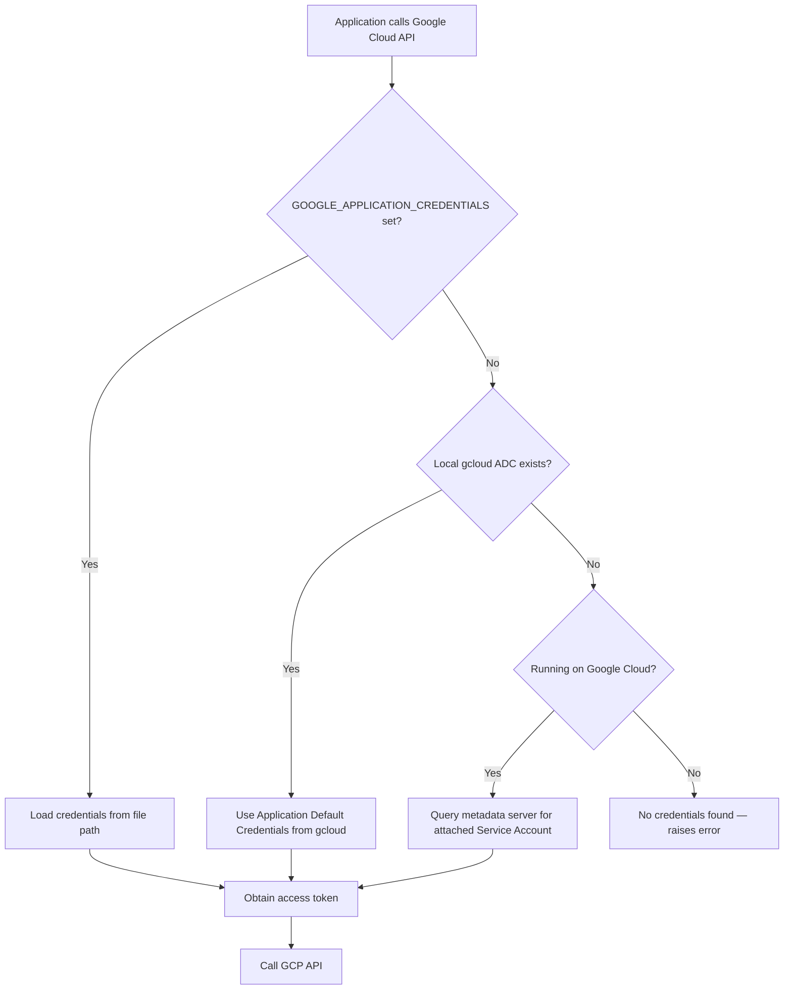
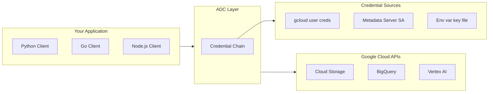
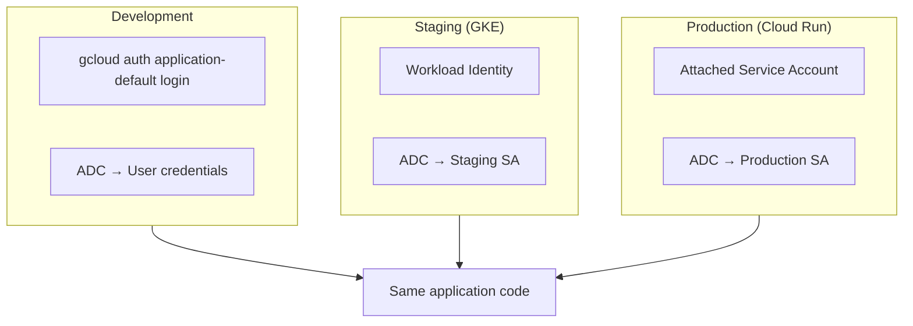

# 🔐 ADC in GCP

> **Application Default Credentials (ADC)** is Google Cloud's recommended way for applications to **automatically find and use credentials** — without hardcoding keys or managing JSON files.

---

## 📚 1. Concept in Detail

### What is ADC?

Application Default Credentials (ADC) is a **credential discovery strategy** built into Google Cloud client libraries. When your code calls `storage.Client()` or `bigquery.Client()`, the library searches a defined chain of credential sources and uses the first one that works.

ADC is **not a credential type itself** — it is a mechanism that resolves to user credentials, service account tokens from the metadata server, or a key file pointed to by an environment variable.

### 🔑 Important Related Concepts

| Concept | Description |
|---------|-------------|
| **Credential Chain** | Ordered search path ADC follows to find credentials |
| **Metadata Server** | GCE/GKE/Cloud Run endpoint that issues SA tokens |
| **gcloud ADC** | User credentials stored locally after `gcloud auth application-default login` |
| **GOOGLE_APPLICATION_CREDENTIALS** | Env var pointing to a credential file (optional override) |
| **Short-Lived Tokens** | ADC typically provides OAuth tokens that expire and refresh |
| **Service Account Impersonation** | ADC can act as a different service account |
| **Workload Identity** | GKE pods get ADC via metadata without key files |
| **Workload Identity Federation** | External CI/CD (GitHub, Azure) gets ADC without keys |
| **google.auth.default()** | Python function that explicitly loads ADC |
| **Client Libraries** | Auto-use ADC when no explicit credentials passed |

### ADC Search Order



### Where ADC Fits in GCP Auth



---

## 🛠️ 2. How to Implement

### Option A: Local Development (User Credentials)

```bash
# Install Google Cloud SDK
# https://cloud.google.com/sdk/docs/install

# Authenticate for ADC
gcloud auth application-default login

# Set default project
gcloud config set project my-project-id

# Verify ADC file exists (typical locations)
# Linux/macOS: ~/.config/gcloud/application_default_credentials.json
# Windows: %APPDATA%\gcloud\application_default_credentials.json
```

```python
from google.cloud import storage

# ADC used automatically — no configuration in code
client = storage.Client()
buckets = list(client.list_buckets())
print([b.name for b in buckets])
```

### Option B: Explicit ADC Inspection (Python)

```python
import google.auth
from google.cloud import bigquery

credentials, project = google.auth.default(
    scopes=["https://www.googleapis.com/auth/cloud-platform"]
)

print(f"Project: {project}")
print(f"Credential type: {type(credentials).__name__}")

client = bigquery.Client(credentials=credentials, project=project)
rows = client.query("SELECT 1 AS test").result()
for row in rows:
    print(row.test)
```

### Option C: On Google Cloud (GCE / Cloud Run / Cloud Functions)

```python
# Attach a service account to the compute resource in GCP Console
# or via gcloud — ADC uses metadata server automatically

from google.cloud import firestore

db = firestore.Client()  # No keys, no env vars needed

doc = db.collection("users").document("user-1").get()
print(doc.to_dict())
```

**Attach service account to Cloud Run:**

```bash
gcloud run deploy my-service \
    --image gcr.io/my-project/my-image \
    --service-account my-sa@my-project.iam.gserviceaccount.com
```

### Option D: GKE with Workload Identity

```bash
# 1. Enable Workload Identity on cluster
gcloud container clusters update my-cluster \
    --workload-pool=my-project.svc.id.goog \
    --region us-central1

# 2. Create Kubernetes service account
kubectl create serviceaccount my-k8s-sa

# 3. Bind K8s SA to Google SA
gcloud iam service-accounts add-iam-policy-binding \
    my-gcp-sa@my-project.iam.gserviceaccount.com \
    --role roles/iam.workloadIdentityUser \
    --member "serviceAccount:my-project.svc.id.goog[default/my-k8s-sa]"

# 4. Annotate K8s SA
kubectl annotate serviceaccount my-k8s-sa \
    iam.gke.io/gcp-service-account=my-gcp-sa@my-project.iam.gserviceaccount.com
```

```yaml
# deployment.yaml
apiVersion: apps/v1
kind: Deployment
metadata:
  name: my-app
spec:
  template:
    spec:
      serviceAccountName: my-k8s-sa
      containers:
        - name: app
          image: gcr.io/my-project/my-app
          # Pod uses ADC via metadata — no key files
```

### Option E: Service Account Impersonation (Local)

```bash
gcloud auth application-default login \
    --impersonate-service-account=app-sa@my-project.iam.gserviceaccount.com
```

```python
import google.auth
from google.auth import impersonated_credentials

source_credentials, _ = google.auth.default()

target_credentials = impersonated_credentials.Credentials(
    source_credentials=source_credentials,
    target_principal="app-sa@my-project.iam.gserviceaccount.com",
    target_scopes=["https://www.googleapis.com/auth/cloud-platform"],
)

from google.cloud import storage
client = storage.Client(credentials=target_credentials)
```

### Option F: CI/CD with Workload Identity Federation (No Keys)

```bash
# GitHub Actions example — uses OIDC token, not SA keys
# Configure WIF pool + provider in GCP IAM
```

```yaml
# .github/workflows/deploy.yml
jobs:
  deploy:
    permissions:
      id-token: write
      contents: read
    steps:
      - uses: google-github-actions/auth@v2
        with:
          workload_identity_provider: projects/123/locations/global/workloadIdentityPools/pool/providers/github
          service_account: deploy-sa@my-project.iam.gserviceaccount.com

      - name: Deploy
        run: gcloud run deploy my-service --image ...
```

---

## 💡 3. Examples

### Example: FastAPI on Cloud Run

```python
from fastapi import FastAPI
from google.cloud import secretmanager

app = FastAPI()

# ADC from Cloud Run metadata server
client = secretmanager.SecretManagerServiceClient()

@app.get("/config/{name}")
async def get_secret(name: str):
    project = "my-project-id"
    resource = f"projects/{project}/secrets/{name}/versions/latest"
    response = client.access_secret_version(request={"name": resource})
    return {"value": response.payload.data.decode("UTF-8")}
```

### Example: Vertex AI with ADC

```python
import vertexai
from vertexai.generative_models import GenerativeModel

vertexai.init(project="my-project", location="us-central1")

model = GenerativeModel("gemini-2.0-flash")
response = model.generate_content("Explain ADC in one sentence.")
print(response.text)
```

### Example: Multi-Environment Pattern



```python
# Same code works everywhere — ADC resolves per environment
from google.cloud import pubsub_v1

publisher = pubsub_v1.PublisherClient()
topic_path = publisher.topic_path("my-project", "events")
publisher.publish(topic_path, b"Hello from ADC!")
```

### Example: Troubleshooting ADC

```bash
# Check active gcloud account
gcloud auth list

# Check ADC status
gcloud auth application-default print-access-token

# Revoke and re-login
gcloud auth application-default revoke
gcloud auth application-default login
```

```python
# Debug credential source in Python
import google.auth
import google.auth.transport.requests

credentials, project = google.auth.default()
credentials.refresh(google.auth.transport.requests.Request())
print(f"Token expires: {credentials.expiry}")
print(f"Service account email: {getattr(credentials, 'service_account_email', 'user credential')}")
```

---

## ✅ 4. Advantages

| Advantage | Details |
|-----------|---------|
| 🔒 **Secure by default** | No long-lived key files in production |
| 🔄 **Auto-refresh** | Tokens expire and renew automatically |
| 🧩 **Zero config on GCP** | Works out of the box on GCE, GKE, Cloud Run |
| 📋 **Google recommended** | Official best practice for all GCP apps |
| 🔧 **Same code everywhere** | Dev, staging, prod use identical client code |
| 🚫 **No secrets in repos** | Eliminates committed credential files |
| 🌐 **WIF support** | CI/CD auth without service account keys |

### 📋 Requirements

**Local development:**
- Google Cloud SDK installed (`gcloud`)
- `gcloud auth application-default login` completed
- IAM permissions on your user or impersonated service account
- Google Cloud client library (`google-cloud-storage`, etc.)

**On Google Cloud:**
- Service account attached to the compute resource
- IAM roles granted to that service account (e.g., `roles/storage.objectViewer`)
- For GKE: Workload Identity enabled and configured

**General:**
- Python 3.8+ (or other supported language SDK)
- `pip install google-auth google-cloud-<service>`
- Network access to `oauth2.googleapis.com` and GCP APIs

### Common IAM Roles (Examples)

| Service | Example Role |
|---------|--------------|
| Cloud Storage | `roles/storage.objectAdmin` |
| BigQuery | `roles/bigquery.dataEditor` |
| Secret Manager | `roles/secretmanager.secretAccessor` |
| Pub/Sub | `roles/pubsub.publisher` |
| Vertex AI | `roles/aiplatform.user` |

---

## 🆚 ADC vs Service Account Keys

| Aspect | ADC | Service Account Key (JSON) |
|--------|-----|--------------------------|
| Security | ✅ High | ⚠️ Low |
| Token lifetime | Short-lived | Long-lived |
| Key file needed | Usually no | Yes |
| Google recommends | ✅ Yes | ❌ Avoid in production |
| Works on GCP compute | ✅ Automatic | Manual setup |
| Rotation | Automatic | Manual |

---

## 🔑 Key Takeaway

> **ADC is the default way Google Cloud applications should authenticate.** Write `client = storage.Client()` and let ADC find credentials — on your laptop via gcloud, on GCP via the metadata server, or in CI via Workload Identity Federation.

---

## 🔗 Quick Reference

| Item | Value |
|------|-------|
| Docs | https://cloud.google.com/docs/authentication/application-default-credentials |
| Python | `google.auth.default()` |
| Local setup | `gcloud auth application-default login` |
| Env var (optional) | `GOOGLE_APPLICATION_CREDENTIALS` |
| ADC file (local) | `~/.config/gcloud/application_default_credentials.json` |
