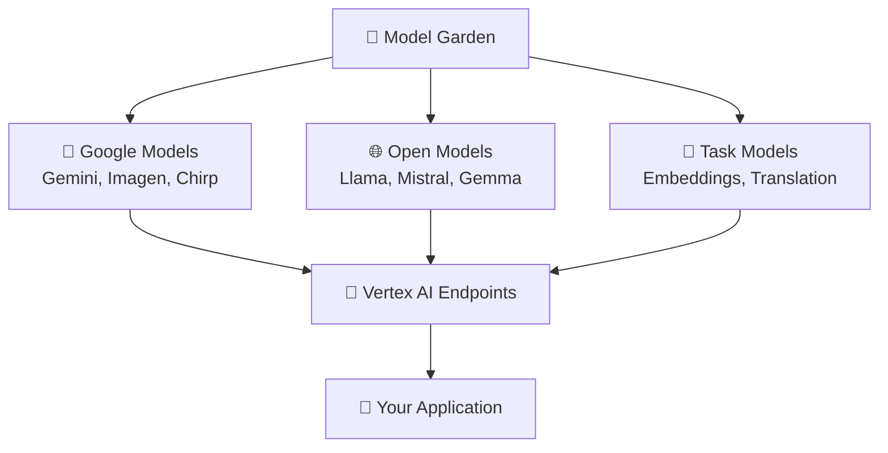
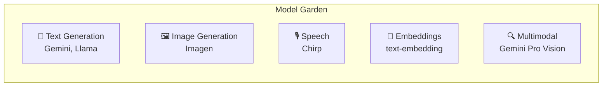

# 🌱 Vertex AI Model Garden

## 📖 What is Vertex AI Model Garden?

**Vertex AI Model Garden** is Google Cloud's curated catalog of **foundation models**, **open-source models**, and **task-specific solutions** available through Vertex AI. It provides a single interface to discover, test, customize, and deploy a wide range of AI models — from Google's Gemini family to open models like Llama, Mistral, and Gemma.



---

## 🧩 Important Concepts

| Concept | Description |
|---------|-------------|
| **Foundation Models** | Large pre-trained models (Gemini, PaLM) |
| **Open Models** | Community models hosted on Vertex AI |
| **Model Card** | Documentation with capabilities and limitations |
| **Fine-tuning** | Adapt models with your data on Vertex AI |
| **Endpoints** | Deployed model instances for inference |
| **Model Registry** | Central repository for model versions |
| **Generative AI Studio** | UI for prompt design and testing |

### Model Categories in Garden



---

## 🛠️ How to Implement

### 1. Enable Vertex AI

```bash
gcloud services enable aiplatform.googleapis.com
gcloud config set project my-project
```

### 2. Use Gemini via Python SDK

```python
import vertexai
from vertexai.generative_models import GenerativeModel

vertexai.init(project="my-project", location="us-central1")

model = GenerativeModel("gemini-2.0-flash")
response = model.generate_content("Explain quantum computing simply.")
print(response.text)
```

### 3. Deploy an Open Model from Model Garden

```python
from vertexai.preview import model_garden

# List available models
models = model_garden.list_models()
for m in models:
    print(f"{m.name}: {m.display_name}")

# Deploy Llama model
model = model_garden.OpenModel("meta/llama-3.1-8b-instruct-maas")
endpoint = model.deploy(
    machine_type="g2-standard-12",
    accelerator_type="NVIDIA_L4",
    accelerator_count=1,
    min_replica_count=1,
    max_replica_count=3,
)
```

### 4. Fine-tune a Model

```python
from google.cloud import aiplatform

aiplatform.init(project="my-project", location="us-central1")

job = aiplatform.PipelineJob(
    display_name="gemini-finetune",
    template_path="gs://google-cloud-aiplatform/schema/trainingjob/definition/gemini_finetune.yaml",
    parameter_values={
        "base_model": "gemini-1.5-flash-002",
        "training_dataset": "gs://my-bucket/training_data.jsonl",
        "epochs": 3,
    },
)
job.run()
```

### 5. Use Embeddings Model

```python
from vertexai.language_models import TextEmbeddingModel

model = TextEmbeddingModel.from_pretrained("text-embedding-005")
embeddings = model.get_embeddings(["Hello world", "Machine learning"])
for emb in embeddings:
    print(f"Dimension: {len(emb.values)}")
```

### 6. REST API Call

```bash
curl -X POST \
  -H "Authorization: Bearer $(gcloud auth print-access-token)" \
  -H "Content-Type: application/json" \
  "https://us-central1-aiplatform.googleapis.com/v1/projects/my-project/locations/us-central1/publishers/google/models/gemini-2.0-flash:generateContent" \
  -d '{
    "contents": [{
      "role": "user",
      "parts": [{"text": "What is Model Garden?"}]
    }]
  }'
```

---

## 💡 Examples

### Example 1: Multimodal Analysis with Gemini

```python
from vertexai.generative_models import GenerativeModel, Part

model = GenerativeModel("gemini-2.0-flash")

image = Part.from_uri(
    "gs://my-bucket/product.jpg",
    mime_type="image/jpeg",
)

response = model.generate_content([
    image,
    "Describe this product and suggest marketing copy.",
])
print(response.text)
```

### Example 2: RAG with Vertex AI Embeddings

```python
from vertexai.language_models import TextEmbeddingModel
import numpy as np

model = TextEmbeddingModel.from_pretrained("text-embedding-005")

def embed_texts(texts: list[str]) -> np.ndarray:
    embeddings = model.get_embeddings(texts)
    return np.array([e.values for e in embeddings])

query_emb = embed_texts(["What is our refund policy?"])
doc_embs = embed_texts(document_chunks)
similarities = np.dot(doc_embs, query_emb.T).flatten()
top_k = np.argsort(similarities)[-5:]
```

### Example 3: Image Generation with Imagen

```python
from vertexai.preview.vision_models import ImageGenerationModel

model = ImageGenerationModel.from_pretrained("imagen-3.0-generate-002")
images = model.generate_images(
    prompt="A futuristic cityscape at sunset, digital art",
    number_of_images=2,
)
images[0].save("output.png")
```

---

## ✅ Advantages

| Advantage | Benefit |
|-----------|---------|
| 🌱 **One-stop shop** | Discover and deploy models from one catalog |
| 🔷 **Google models** | Access latest Gemini, Imagen, Chirp models |
| 🌐 **Open models** | Llama, Mistral without managing infrastructure |
| 🔧 **Managed infra** | No GPU cluster management required |
| 🔒 **Enterprise security** | VPC-SC, IAM, data residency controls |
| 📈 **Scalable** | Auto-scaling endpoints for production |

## 📋 Requirements

- GCP project with **Vertex AI API** enabled
- **Billing** account with sufficient quota
- **IAM permissions**: `aiplatform.user`, `aiplatform.admin`
- **Region selection** (us-central1, europe-west4, etc.)
- For fine-tuning: formatted **training data** in GCS
- For open model deployment: appropriate **GPU quota**

---

## 📊 Model Garden vs Alternatives

| Feature | Vertex AI Model Garden | Hugging Face | AWS Bedrock |
|---------|----------------------|--------------|-------------|
| Google models | ✅ Native | ❌ | ❌ |
| Open models | ✅ Managed | ✅ Self-host | ✅ Managed |
| Fine-tuning | ✅ Vertex AI | ✅ Various | ✅ Bedrock |
| GCP integration | ✅ Native | Third-party | AWS only |
