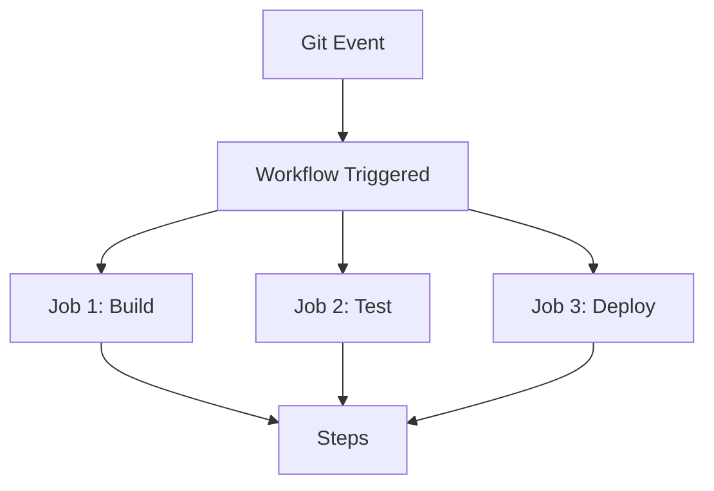
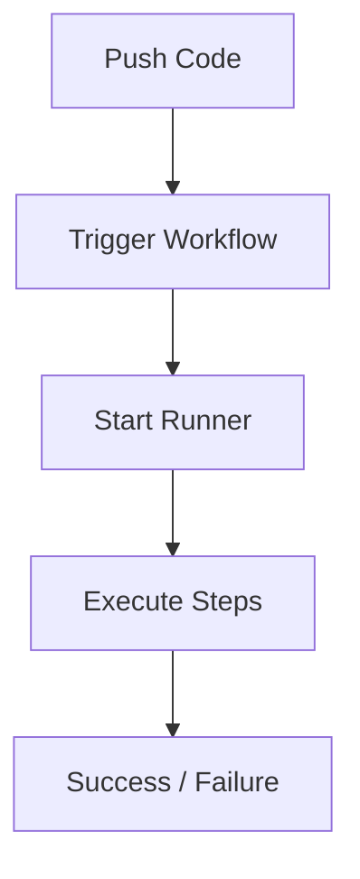
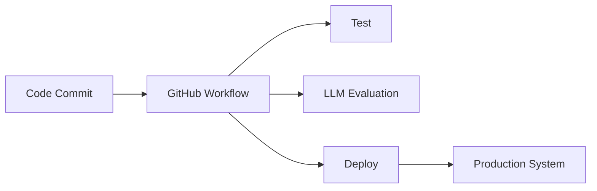

# ⚙️ 1. What are GitHub Workflows?

**GitHub Actions** workflows are **automated pipelines** defined in YAML that run when events happen in your repository.

---

## 🎯 Core Idea

Instead of:

```text
Developer → Run tests → Build → Deploy (manually)
```

👉 You define:

```text
Code Push → Workflow → Test → Build → Deploy (automatically)
```

---

## 🧠 Key Concepts

### 📦 1. Workflow

* A YAML file defining automation
* Stored in:

```bash
.github/workflows/
```

---

### ⚡ 2. Events (Triggers)

When workflow runs:

* `push`
* `pull_request`
* `schedule` (cron)
* `workflow_dispatch` (manual)

---

### 🧩 3. Jobs

* A workflow contains **jobs**
* Each job runs on a runner (VM)

---

### 🔁 4. Steps

* Each job has steps:

  * Install dependencies
  * Run tests
  * Deploy

---

### 🖥️ 5. Runners

Machines where jobs run:

* Ubuntu (default)
* Windows
* MacOS

---

### 🔐 6. Secrets

* Store API keys securely
* Access via `${{ secrets.KEY }}`

---

## 🔁 Workflow Architecture



---

# ⚙️ 2. How to Set Up GitHub Workflows

## 🧩 Step 1: Create Folder

```bash
mkdir -p .github/workflows
```

---

## 🧩 Step 2: Create YAML File

```bash
.github/workflows/ci.yml
```

---

## 🧩 Step 3: Define Workflow

```yaml
name: CI Pipeline

on:
  push:
    branches: [main]

jobs:
  build:
    runs-on: ubuntu-latest

    steps:
      - name: Checkout code
        uses: actions/checkout@v3

      - name: Set up Python
        uses: actions/setup-python@v4
        with:
          python-version: 3.10

      - name: Install dependencies
        run: pip install -r requirements.txt

      - name: Run tests
        run: pytest
```

---

## 🧩 Step 4: Push to GitHub

👉 Workflow runs automatically 🎉

---

# 🔁 Execution Flow



---

# 💻 3. Examples

---

## 🧪 Example 1: Python CI

```yaml
name: Python CI

on: [push]

jobs:
  test:
    runs-on: ubuntu-latest

    steps:
      - uses: actions/checkout@v3

      - uses: actions/setup-python@v4
        with:
          python-version: 3.10

      - run: pip install pytest
      - run: pytest
```

---

## 🚀 Example 2: Deploy to Server

```yaml
name: Deploy App

on:
  push:
    branches: [main]

jobs:
  deploy:
    runs-on: ubuntu-latest

    steps:
      - name: Deploy via SSH
        run: |
          ssh user@server "cd app && git pull && restart-service"
```

---

## 🤖 Example 3: LLM App CI/CD

```yaml
name: LLM Pipeline

on:
  push:
    branches: [main]

jobs:
  test-llm:
    runs-on: ubuntu-latest

    steps:
      - uses: actions/checkout@v3

      - name: Install deps
        run: pip install -r requirements.txt

      - name: Run evaluation
        run: python eval.py
```

---

# 🔐 4. Using Secrets

## Add Secret in GitHub:

* Repo → Settings → Secrets → Actions

---

## Use in Workflow:

```yaml
env:
  OPENAI_API_KEY: ${{ secrets.OPENAI_API_KEY }}
```

---

# 🧠 5. Advanced Concepts

---

## 🔁 Matrix Builds (Multiple Versions)

```yaml
strategy:
  matrix:
    python-version: [3.8, 3.9, 3.10]
```

---

## ⏰ Scheduled Jobs

```yaml
on:
  schedule:
    - cron: "0 0 * * *"
```

---

## 🎯 Conditional Execution

```yaml
if: github.ref == 'refs/heads/main'
```

---

## 🔗 Reusable Workflows

* Share workflows across repos

---

# 🧪 6. Real-world Use Cases

---

## 🧪 Example 1: CI Pipeline

* Run tests on every PR

---

## 🚀 Example 2: CD Pipeline

* Auto deploy after merge

---

## 🤖 Example 3: LLM Evaluation Pipeline

* Run evaluation scripts
* Track model performance

---

## 📊 Example 4: Data Pipelines

* Run ETL jobs daily

---

# 🚀 7. Advantages

### ⚡ Automation

No manual work

---

### 🔁 Consistency

Same steps every time

---

### 🚀 Faster Delivery

CI/CD pipeline

---

### 🔐 Secure

Secrets management

---

### 📈 Scalable

Handles multiple workflows

---

# ⚠️ 8. Requirements

### 📦 GitHub Repository

Code must be in GitHub

---

### 🧠 YAML Knowledge

Understand workflow syntax

---

### 🔐 Secrets Setup

API keys, credentials

---

### ⚙️ Dependency Setup

Install tools inside workflow

---

# 🔄 9. GitHub Workflows in AI Stack



---

# 🧾 Final Summary

### ⚙️ GitHub Workflows =

* 📦 YAML-based automation
* ⚡ Event-driven execution
* 🧩 Jobs + steps
* 🔐 Secrets management
* 🚀 CI/CD pipelines

---

### Using GitHub workflows to create CI/CD pipeline to deploy to GitHub Pages


---

### 🧠 In One Line

👉 *GitHub Workflows automate your entire development and deployment lifecycle*

---

## 🔧 Quick Setup Checklist

1. Create `.github/workflows/ci.yml`
2. Define `on:` trigger
3. Add `jobs:`
4. Add `steps:`
5. Push code
