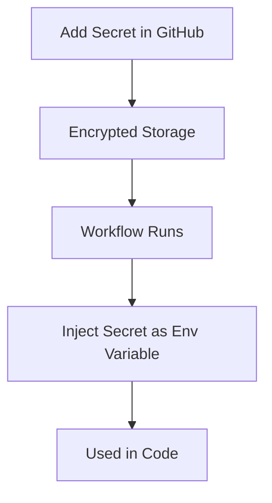

# 🔐 1. What are GitHub Secrets?

**GitHub Secrets** are **encrypted environment variables** used to securely store sensitive data like:

* 🔑 API keys (OpenAI, AWS, etc.)
* 🔐 Tokens (JWT, OAuth)
* 🧾 Credentials (DB passwords)

---

## 🎯 Core Idea

Instead of:

```yaml
env:
  API_KEY: "my-secret-key" ❌
```

👉 You do:

```yaml
env:
  API_KEY: ${{ secrets.API_KEY }} ✅
```

---

## 🧠 Key Concepts

---

### 🔒 1. Encryption

* Secrets are encrypted at rest
* Not visible after creation

---

### 🧩 2. Scoped Access

| Scope        | Usage                      |
| ------------ | -------------------------- |
| Repository   | Single repo                |
| Environment  | Per environment (dev/prod) |
| Organization | Across repos               |

---

### ⚡ 3. Runtime Injection

Secrets are injected **only during workflow execution**

---

### 🚫 4. Masking in Logs

* Automatically hidden in logs
* Replaced with `***`

---

### 🧪 5. Usage Context

Used inside:

* GitHub Actions workflows
* Codespaces
* Dependabot (limited)

---

# 🔁 Secret Flow



---

# ⚙️ 2. How to Set Up GitHub Secrets

---

## 🧩 Step 1: Go to Repository

👉 Navigate to:

```text
Repo → Settings → Secrets and variables → Actions
```

---

## 🧩 Step 2: Add New Secret

* Click **"New repository secret"**
* Add:

  * Name: `OPENAI_API_KEY`
  * Value: `your_key_here`

---

## 🧩 Step 3: Save

👉 Secret is now securely stored 🔐

---

## 🧩 Step 4: Use in Workflow

```yaml
env:
  OPENAI_API_KEY: ${{ secrets.OPENAI_API_KEY }}
```

---

# 💻 3. Code Examples

---

## 🧪 Example 1: Using Secret in Workflow

```yaml id="c8r3j9"
name: Use Secret

on: [push]

jobs:
  test:
    runs-on: ubuntu-latest

    steps:
      - name: Print Secret
        run: echo "Key is $OPENAI_API_KEY"
        env:
          OPENAI_API_KEY: ${{ secrets.OPENAI_API_KEY }}
```

👉 Output will show:

```text
Key is ***
```

---

## 🤖 Example 2: Using in Python App

```yaml id="y5i7zm"
- name: Run Python Script
  run: python app.py
  env:
    OPENAI_API_KEY: ${{ secrets.OPENAI_API_KEY }}
```

```python id="zqk2jp"
import os

api_key = os.getenv("OPENAI_API_KEY")
print("Key loaded:", bool(api_key))
```

---

## 🚀 Example 3: Deploy with SSH Key

```yaml id="6k4qvb"
- name: Deploy
  run: |
    ssh -i key.pem user@server "deploy.sh"
  env:
    SSH_PRIVATE_KEY: ${{ secrets.SSH_KEY }}
```

---

# 🧠 4. Advanced Usage

---

## 🌍 Environment-specific Secrets

Example:

* `DEV_API_KEY`
* `PROD_API_KEY`

```yaml id="sj2k2d"
env:
  API_KEY: ${{ secrets.PROD_API_KEY }}
```

---

## 🧩 Organization Secrets

* Shared across multiple repos

---

## 🔁 Reusable Workflows with Secrets

Pass secrets to reusable workflows securely

---

## 🔐 OIDC (Advanced)

* Avoid storing cloud credentials
* Use short-lived tokens instead

---

# 🧪 5. Real-world Examples

---

## 🤖 Example 1: LLM App

* Store:

  * OpenAI key
  * Vector DB key

---

## 🚀 Example 2: Deployment

* Store:

  * AWS credentials
  * Docker registry tokens

---

## 📊 Example 3: Data Pipelines

* Store:

  * DB credentials
  * API tokens

---

# 🚀 6. Advantages

---

### 🔐 Strong Security

No secrets in code

---

### ⚡ Easy Integration

Simple YAML usage

---

### 🔁 Centralized Management

Manage all secrets in one place

---

### 🚫 Log Protection

Secrets are masked automatically

---

# ⚠️ 7. Requirements / Limitations

---

### ❌ Cannot View Secret Value Again

* Must re-add if lost

---

### 🔐 Access Control Needed

* Limit who can modify secrets

---

### ⚠️ Not Available in Fork PRs (by default)

* Security restriction

---

### 🧠 Naming Discipline

* Use clear naming:

  * `OPENAI_API_KEY`
  * `DB_PASSWORD`

---

# 🔄 8. Secrets in CI/CD Flow


---

# 🧾 Final Summary

### 🔐 GitHub Secrets =

* 🔒 Encrypted storage
* ⚡ Runtime injection
* 🚫 Masked in logs
* 🧩 Scoped access (repo/org/env)

---

### 🧠 In One Line

👉 *GitHub Secrets securely inject sensitive data into your workflows without exposing it*

---

## ✅ Quick Setup Checklist

1. Go to **Repo Settings → Secrets**
2. Add secret (`KEY`, `VALUE`)
3. Reference in YAML:

   ```yaml
   ${{ secrets.KEY }}
   ```
4. Use in app via environment variables


