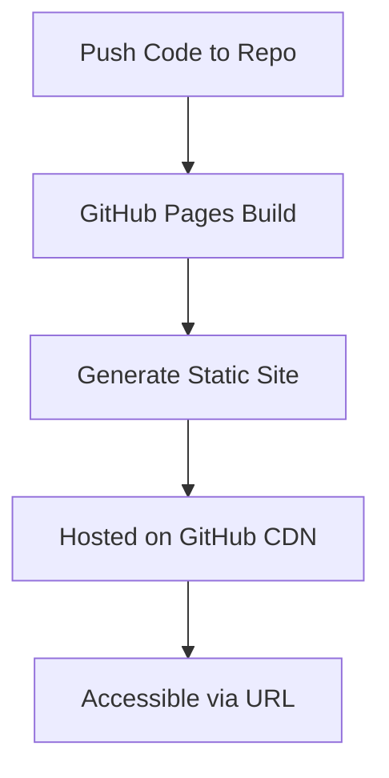
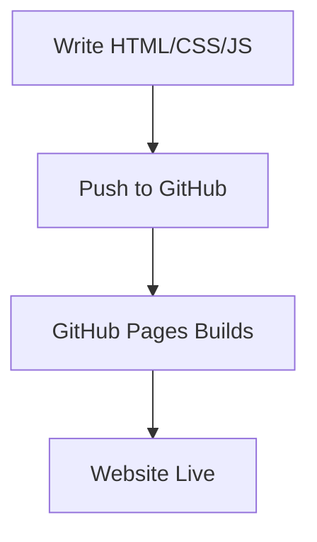
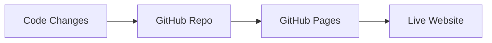

# 🌐 1. What is GitHub Pages?

**GitHub Pages** is a **free hosting service** that lets you publish **static websites directly from your GitHub repository**.

---

## 🎯 Core Idea

Instead of:

```text id="sxtjdm"
Build website → Buy server → Deploy → Maintain infra
```

👉 You do:

```text id="ecrsgp"
Push code → GitHub → Website is live 🚀
```

---

## 🧠 What “Static Website” Means

* HTML
* CSS
* JavaScript

❌ No backend (Node, Python, DB)

---

## 🔑 Key Concepts

---

### 📦 1. Repository-based Hosting

Your site lives in:

* A repo OR
* A specific branch/folder

---

### 🌍 2. URL Structure

| Type         | URL                            |
| ------------ | ------------------------------ |
| User site    | `username.github.io`           |
| Project site | `username.github.io/repo-name` |

---

### 🌿 3. Branch Source

You can deploy from:

* `main`
* `gh-pages`
* `/docs` folder

---

### 🎨 4. Jekyll Support

* Static site generator
* Converts Markdown → HTML

---

### 🔐 5. Custom Domains

* Use your own domain (e.g., `myportfolio.com`)

---

# 🔁 How GitHub Pages Works



---

# ⚙️ 2. How to Set Up GitHub Pages

---

## 🧩 Step 1: Create Repository

Example:

```text id="ff8y42"
my-website
```

---

## 🧩 Step 2: Add Website Files

```bash id="yfrx2q"
index.html
style.css
script.js
```

---

## 🧩 Step 3: Enable GitHub Pages

👉 Go to:

```text id="zuz3sz"
Repo → Settings → Pages
```

* Select:

  * Branch: `main`
  * Folder: `/root`

---

## 🧩 Step 4: Save

👉 Your site will be live at:

```text id="o61rba"
https://username.github.io/my-website
```

---

# 💻 3. Code Examples

---

## 🧪 Example 1: Simple HTML Page

```html id="9jd3jh"
<!DOCTYPE html>
<html>
<head>
  <title>My Site</title>
</head>
<body>
  <h1>🚀 Hello GitHub Pages</h1>
</body>
</html>
```

---

## 🎨 Example 2: Add CSS

```html id="a0rd1y"
<link rel="stylesheet" href="style.css">
```

```css id="f7s2lp"
body {
  background: #111;
  color: white;
}
```

---

## ⚡ Example 3: JavaScript

```html id="t8o0yk"
<script>
  console.log("Site loaded!");
</script>
```

---

# 🔁 Deployment Flow



---

# 🧪 4. Real-world Examples

---

## 🌐 Example 1: Portfolio Website

* Showcase projects
* Resume

---

## 📘 Example 2: Documentation Site

* API docs
* Guides

---

## 🤖 Example 3: LLM Project UI

* Static frontend
* Calls backend APIs

---

## 📝 Example 4: Blog

* Markdown → Jekyll → HTML

---

# ⚙️ 5. Advanced Setup

---

## 🚀 Deploy with GitHub Actions

```yaml id="e4a9nm"
name: Deploy Pages

on:
  push:
    branches: [main]

jobs:
  deploy:
    runs-on: ubuntu-latest

    steps:
      - uses: actions/checkout@v3
      - name: Deploy
        run: echo "Deploying site..."
```

---

## 🌍 Custom Domain

Add file:

```bash id="w3gsv8"
CNAME
```

Content:

```text id="rbbq0w"
www.mywebsite.com
```

---

## 🧩 Disable Jekyll

```bash id="q0kl3x"
touch .nojekyll
```

---

# 🚀 6. Advantages

---

### 💰 Free Hosting

No cost

---

### ⚡ Simple Setup

No servers needed

---

### 🔄 Git-based Deployment

Push = deploy

---

### 🌍 CDN Powered

Fast global delivery

---

### 🔐 HTTPS Included

Secure by default

---

# ⚠️ 7. Requirements / Limitations

---

### ❌ Static Only

No backend support

---

### 🧠 Basic Web Knowledge

HTML/CSS/JS needed

---

### ⏱️ Build Time

Deployment takes a few seconds

---

### 📦 File Size Limits

Large files not ideal

---

# 🔄 8. GitHub Pages in Dev Workflow



---

# 🧾 Final Summary

### 🌐 GitHub Pages =

* 📦 Static site hosting
* 🚀 Git-based deployment
* 🌍 Free CDN hosting
* 🔐 HTTPS enabled

---

### 🧠 In One Line

👉 *GitHub Pages turns your repository into a live website*

---

## ✅ Quick Setup Checklist

1. Create repo
2. Add `index.html`
3. Go to **Settings → Pages**
4. Select branch
5. Access your URL
