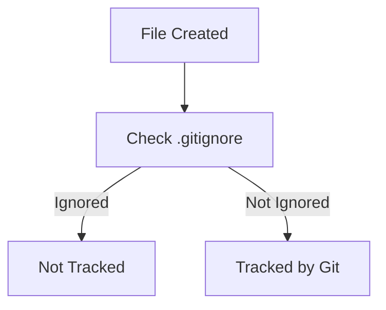
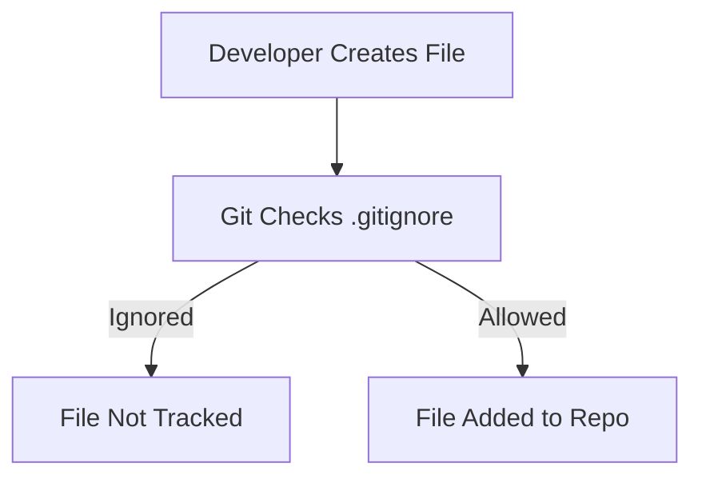
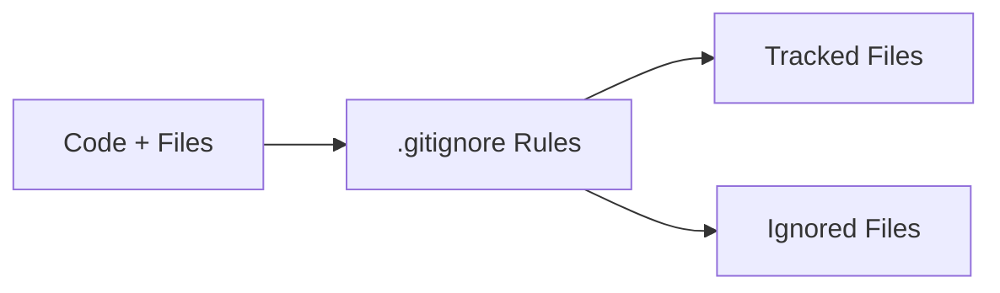

# 📄 1. What is `.gitignore`?

A **`.gitignore` file** tells Git:

> ❌ “Ignore these files/folders — don’t track or commit them”

---

## 🎯 Core Idea

Instead of committing everything:

```text id="u7aqa7"
project/
 ├── app.py
 ├── .env        ❌ (should NOT be committed)
 ├── logs/       ❌
 ├── node_modules/ ❌
```

👉 You define rules:

```text id="5y6x5g"
.gitignore → tells Git what to skip
```

---

## 🧠 Why it matters

* 🔐 Protect secrets
* 🧹 Keep repo clean
* ⚡ Improve performance
* 📦 Avoid large/unnecessary files

---

# 🔑 2. Core Concepts

---

## 📌 1. Ignore Patterns

```bash id="w5hfsd"
node_modules/
*.log
.env
```

---

## 📌 2. Wildcards

| Pattern    | Meaning                  |
| ---------- | ------------------------ |
| `*.log`    | All `.log` files         |
| `temp*`    | Files starting with temp |
| `**/build` | Any build folder         |

---

## 📌 3. Negation (!)

```bash id="i2d3rd"
*.log
!important.log
```

👉 Ignore all logs except one

---

## 📌 4. Directory vs File

```bash id="dgn6qx"
build/   # folder
config.json  # file
```

---

## 📌 5. Global vs Local `.gitignore`

* Repo-level → `.gitignore`
* Global → applies to all repos

---

# 🔁 How `.gitignore` Works



---

# ⚙️ 3. How to Implement `.gitignore`

---

## 🧩 Step 1: Create File

```bash id="p9e0aq"
touch .gitignore
```

---

## 🧩 Step 2: Add Rules

```bash id="y1zncz"
# Ignore env files
.env

# Ignore logs
*.log

# Ignore Python cache
__pycache__/

# Ignore node modules
node_modules/
```

---

## 🧩 Step 3: Commit

```bash id="l3mtlx"
git add .gitignore
git commit -m "Add gitignore"
```

---

# ⚠️ Important Gotcha

👉 `.gitignore` does NOT remove already tracked files

Fix:

```bash id="eqxysn"
git rm -r --cached .
git add .
git commit -m "Apply gitignore"
```

---

# 💻 4. Examples

---

## 🐍 Example: Python Project

```bash id="m3v6tx"
__pycache__/
*.pyc
.env
venv/
```

---

## 🌐 Example: Node.js Project

```bash id="cv3rfx"
node_modules/
.env
dist/
npm-debug.log
```

---

## 🤖 Example: LLM Project

```bash id="e8qk3n"
.env
*.log
.cache/
vector_db/
outputs/
```

👉 Avoid:

* API keys
* Large embeddings
* Temporary outputs

---

# 🧠 5. Advanced Patterns

---

## 📂 Ignore Everything in Folder Except One File

```bash id="a3w1mx"
data/*
!data/important.csv
```

---

## 🌍 Global `.gitignore`

```bash id="l2q6os"
git config --global core.excludesfile ~/.gitignore_global
```

---

## 🧩 Multiple `.gitignore` Files

* Can exist in subfolders

---

# 🔄 Real-world Workflow



---

# 🧪 6. Real-world Use Cases

---

## 🔐 Example 1: Protect Secrets

```bash id="pntvch"
.env
```

---

## ⚡ Example 2: Ignore Build Files

```bash id="hf1y2p"
dist/
build/
```

---

## 📊 Example 3: Ignore Logs

```bash id="k1axq8"
*.log
```

---

## 🤖 Example 4: AI Projects

```bash id="c5zjhs"
outputs/
.cache/
embeddings/
```

---

# 🚀 7. Advantages

---

### 🔐 Security

Prevents accidental secret leaks

---

### 🧹 Clean Repo

No unnecessary files

---

### ⚡ Faster Git Operations

Less data to track

---

### 📦 Better Collaboration

Consistent environment

---

# ⚠️ 8. Requirements / Limitations

---

### ❌ Doesn’t Remove Tracked Files

Must manually untrack

---

### 🧠 Needs Proper Configuration

Bad rules → important files ignored

---

### 🔐 Not a Security Tool Alone

Secrets should still be managed via:

* Env variables
* Secret managers

---

# 🔄 9. `.gitignore` in Dev Workflow



---

# 🧾 Final Summary

### 📄 `.gitignore` =

* ❌ Prevents tracking unwanted files
* 🔐 Protects sensitive data
* 🧹 Keeps repo clean
* ⚡ Improves performance

---

### 🧠 In One Line

👉 *`.gitignore` tells Git what NOT to care about*

---

## ✅ Quick Setup Checklist

1. Create `.gitignore`
2. Add patterns (`.env`, `*.log`, etc.)
3. Commit file
4. Remove already tracked unwanted files
